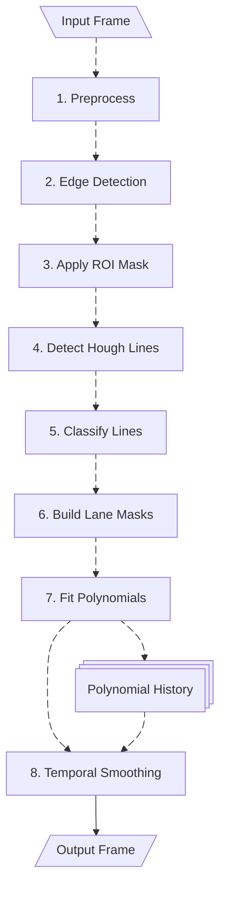

# Lane Keep Assist (LKA) — Video Lane Detection & Annotation

**Name:** Lorenz Killer \
**Neptun:** WWC6UF

A compact, classical-computer-vision-based lane detector that detects left/right lane boundaries in road videos, overlays polylines on frames, and logs per-frame confidence metrics to CSV. The code is written in C++17 with OpenCV and runs in real time on common clips.

## Table of Contents

[1 - Project Goals](#1---project-goals) \
[2 - Lane Detection Pipeline](#2---lane-detection-pipeline) \
[3 - Results](#3---results) \
[4 - Design choices & Limitations](#4---design-choices--limitations)
[5 - Build and Run](#5---build-and-run) \
[6 - File Layout](#6---file-layout)

## 1 - Project Goals

The objective of this project is to develop a system that detects and tracks lane markings from driving video footage, similar to the perception component of a lane-keeping assist (LKA) system. The system aims to determine, for each frame, whether the left and right lane boundaries are detected, visualize them as overlaid polylines on the road, and estimate a confidence level for each side. The final outputs include an annotated video with lane overlays and a heads-up display (HUD), as well as a CSV file logging the per-frame detection status and confidence values.

## 2 - Lane Detection Pipeline

The detection pipline follows a linear approach, with the exception of a Polynomial History Buffer which is used for smoothing the line polynomials.
Find below a flow chart of process. Each individual step is explained in detail further below.


*Fig. 1: Flowchart Diagram of the Detection Pipeline*

### Step 1 – Preprocess  
- Convert the input BGR frame to HLS color space  
- Extract the L (lightness) channel
- Apply **Contrast Limited Adaptive Histogram Equalization (CLAHE)** to improve contrast and stabilize edges under varying lighting.  

### Step 2 – Edge Detection  
- Apply Gaussian blur to suppress noise.  
- Use the **Canny** edge detector to obtain edges.  

### Step 3 – Apply ROI Mask  
- Generate a region of interest mask keeping the lower `roiKeepRatio` portion of the image.  
- Optionally cut side regions based on `roiAngleDeg`.  
- Apply the mask to retain only relevant road areas.  

### Step 4 – Detect Hough Lines  
- Run the **Hough Transform** on the masked edge image to find line segments.  
- Parameters such as `rho` (distance resolution) and `theta` (angle resolution) control detection granularity.  
- Adjust `threshold`, `minLineLength`, and `maxLineGap` to balance noise rejection and line continuity.  
- Visualize the raw detected lines for debugging.  

### Step 5 – Classify Lines  
- Use raycasting to identify initial left and right seed lines.  
- Apply **RANSAC** to filter outliers and refine the seed lines.  
- Group all lines that agree in slope and position with the seeds.  
- Visualize classified left and right line sets.  

### Step 6 – Build Lane Masks  
- For each side, sweep a kernel along the line segments to collect nearby edge pixels.  
- Construct binary masks for left and right lanes.  
- Overlay the two lane masks in color for visualization.  

### Step 7 – Fit Polynomials  
- Extract lane pixel coordinates from each mask.  
- Fit a quadratic function \( x(y) = a y^2 + b y + c \) for each side.  
- Draw the raw polynomial fits for inspection.   

### Step 8 – Temporal Smoothing  
- Maintain a short history of polynomial coefficients for each lane side.  
- Apply **exponential moving averaging**, where recent frames have higher weight to keep the response quick but stable.  
- If a lane temporarily disappears, reuse the last valid polynomial and slowly decay confidence instead of resetting abruptly.  
- Blend the smoothed coefficients into the final polynomial curves used for visualization and confidence estimation. 

### Additionally:
- Estimate per-side confidence based on line consistency and mask quality.  
- Write per-frame results (status + confidence) to CSV.  
- Draw final overlays: solid curves for detected lanes, dashed or fallback guides otherwise.  
- Add a HUD showing detection states and confidence levels.  
- Optionally store debug views of all intermediate steps.


*Fig. 2: Debug View of the Lane Detection Pipeline with all the steps visualized seperately*

## 3 - Results
The implemented pipeline proofs to generate good results for various scenarios.
Because of the lightweight focus and the efficient implementation in C++, the algorithm runs generally stable with around 25 FPS.
Find below a few demonstrations, the full-length generated result videos can be found [here](data/).

### Basic
Proof of concept test for the pipeline. Clear weather, straight road, some road markings dashed.


Works smothly, some minor jumps and bends of the polygons due to misclassification of lines get mostly smoothed out by temporal smoothing. 

### Night
Higher Speed and night environment. Motion blur and high contrast in scene due to lights.


Still working very smooth even though lines tend to be more "shaky".
Parameter tuning for a "night setting" could prevent that.

### City
Several Cars on the road and many structured edges next to the road (fences) and on top of the road (markings).


The lane is correctly found except for when there is a marking in the middle of the road. This is due to my "raycasting" classification approach and could be handled with a more robust outlier rejection.

### Rain
Very curvy road, raindrops on the windshield, many reflections due to water on the road.


Here we can see the lane jumping and bending a lot. This scenario would definitely need more parameter tuning and maybe additional steps in the pipeline for backup strategies.

## 4 – Design Choices & Limitations  
The project was designed for **real-time performance** with a **lightweight C++ implementation**, keeping dependencies minimal and ensuring around **25 FPS** in typical conditions on basic CPU hardware. The custom **raycasting-based classification** was chosen to explore a self-built custom approach rather than relying on existing solutions / pipelines. It works well in clear scenes but can misclassify in cluttered or reflective environments, where stronger outlier rejection would help.  

Some **accuracy trade-offs** were accepted to keep the system fast and simple. While it performs reliably under normal conditions, it struggles with heavy rain, glare, or dense urban edges. Overall, the design meets its goal as a **proof of concept**—a robust, real-time lane detection pipeline that remains interpretable and efficient.

## 5 - Build and Run

### Build 

Option A — Dev Container / Docker (Ubuntu 22.04, OpenCV preinstalled):
- Container definition: [`Dockerfile`](Dockerfile)
- Just open in VS Code Dev Containers and build.

Option B — Local
- Requirements: C++17 compiler, OpenCV 4 (pkg-config preferred).
- Build with the provided [`Makefile`](Makefile):

### Run

Run on file or camera input:
```sh
# Run with a video file as input
bin/lane_detector path/to/video.mp4
# Run with webcam as input
bin/lane_detector
```

**CLI Options:** 
- `--no-debug`: disable the debug mosaic and per-step writers
- `--scale=F`: resize factor (e.g., 0.5 for half-size)
- `--stride=N`: process every Nth frame
- `--fast`: short-hand for fast preview (no debug, stride=2, scale=0.5)

**Examples:**
```sh
# Quick preview (every 2nd frame, half size):
bin/lane_detector --fast path/to/video.mp4

# Full debug, 80% scale:
bin/lane_detector --scale=0.8 path/to/video.mp4
```

**Artifacts** (auto-created in `output/`):
- `00_input.mp4`: resized input stream
- `99_output.mp4`: final overlay video
- `metrics.csv`: per-frame metrics
- Optional per-step MP4s when debug is enabled (see Debug UI)

Windows and Linux are supported. Video writers attempt H.264 (`avc1`) then fall back to `mp4v`.

## 6 - File Layout

- Entry point and UI:
  - [`src/main.cpp`](src/main.cpp)
- Lane detector API and implementation:
  - Header: [`include/lane_detector.h`](include/lane_detector.h)
  - Source: [`src/lane_detector.cpp`](src/lane_detector.cpp)
- Data
  - Example Input Videos: ['data/*'](data/)
- Utilities (text box, mosaics, crosshair, etc.):
  - Header: [`include/utils.h`](include/utils.h)
  - Source: [`src/utils.cpp`](src/utils.cpp)
- Build:
  - [`Makefile`](Makefile)
  - [`Dockerfile`](Dockerfile)
  - [`docker-compose.yml`](docker-compose.yml)
- Saved results:
  - [`results/1-basic.csv`](results/1-basic.mp4)
  - [`results/1-basic.csv`](results/1-basic.csv)
  - ...
